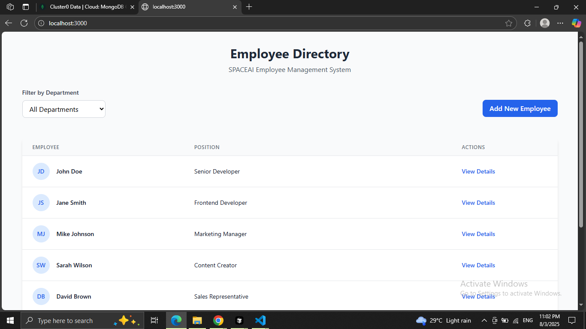
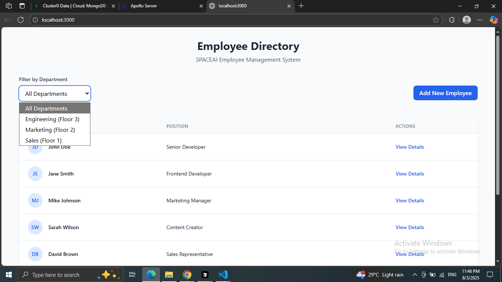
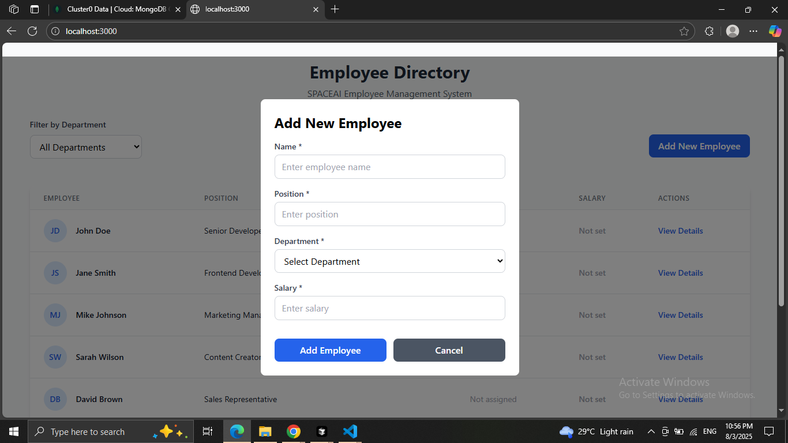
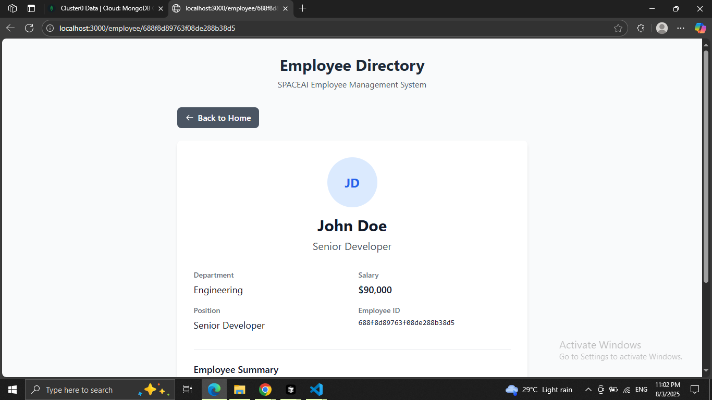
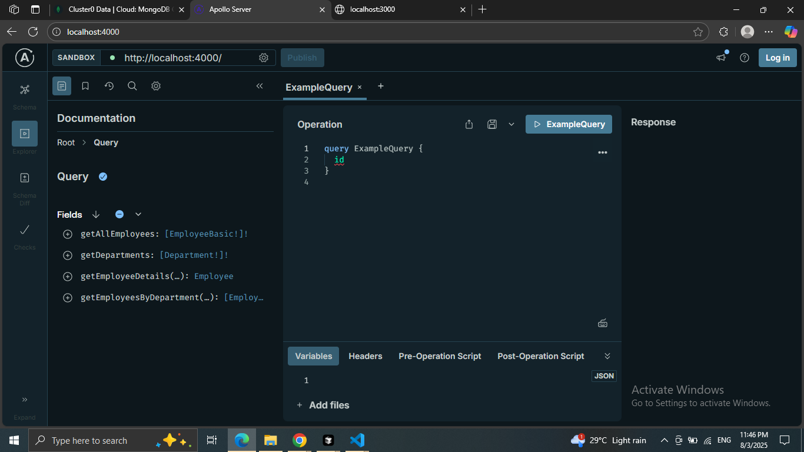

# 🚀 Employee Directory Application

## 📱 Application Screenshots

<p align="center">
  
  
  
  
  
</p>


---


## 🏗️ Architecture Overview

```
┌─────────────────┐    ┌──────────────────┐    ┌─────────────────┐
│   Frontend      │    │    Backend       │    │    Database     │
│   (Next.js)     │◄───┤  (Node.js +      │◄───┤   (MongoDB)     │
│                 │    │   GraphQL)       │    │                 │
│ • Apollo Client │    │ • Apollo Server  │    │ • employees     │
│ • Tailwind CSS  │    │ • GraphQL Schema │    │ • departments   │
│ • React Hooks   │    │ • Resolvers      │    │                 │
└─────────────────┘    └──────────────────┘    └─────────────────┘
```

## 🛠️ Technology Stack

### **Backend**
- **Node.js** - Runtime environment
- **Apollo Server 4** - GraphQL server implementation
- **GraphQL** - Query language and API standard
- **MongoDB** - NoSQL database
- **MongoDB Native Driver** - Database connection (no ORM)

### **Frontend**
- **Next.js 14** - React framework with App Router
- **React 18** - UI library with modern hooks
- **Apollo Client** - GraphQL client with intelligent caching
- **Tailwind CSS** - Utility-first CSS framework
- **Lucide React** - Icon library

### **Development Tools**
- **ESLint** - Code linting
- **PostCSS** - CSS processing
- **Nodemon** - Development server auto-restart

---

## ⚡ Quick Start Guide

### **Prerequisites**
- Node.js 18+ installed
- MongoDB running locally (or MongoDB Atlas connection)
- Git for version control

### **1. Clone & Setup**
```bash
# Clone the repository
git clone <repository-url>
cd employee-directory

# Install backend dependencies
cd backend
npm install

# Install frontend dependencies
cd ../frontend
npm install
```

### **2. Environment Configuration**
```bash
# Backend (.env file in backend folder)
MONGODB_URI=mongodb://localhost:27017/employee-directory
NODE_ENV=development

# Frontend (automatic configuration)
# GraphQL endpoint: http://localhost:4000
```

### **3. Database Setup**
```bash
# Seed the database with sample data
cd backend
npm run seed
```

### **4. Start the Application**
```bash
# Terminal 1 - Start Backend (GraphQL Server)
cd backend
npm run dev
# Server runs on: http://localhost:4000

# Terminal 2 - Start Frontend (Next.js)
cd frontend
npm run dev
# Application runs on: http://localhost:3000
```

### **5. Access the Application**
- **Frontend**: http://localhost:3000
- **GraphQL Playground**: http://localhost:4000
- **Database**: MongoDB on port 27017

---


## 🔧 Project Structure

```
employee-directory/
├── backend/
│   ├── package.json
│   ├── server.js                 # Apollo Server setup
│   ├── schema/
│   │   ├── typeDefs.js          # GraphQL schema definitions
│   │   └── resolvers.js         # GraphQL resolvers
│   ├── database/
│   │   ├── connection.js        # MongoDB connection
│   │   └── seedData.js          # Database seeding script
│   └── .env                     # Environment variables
│
└── frontend/
    ├── package.json
    ├── next.config.js           # Next.js configuration
    ├── tailwind.config.js       # Tailwind CSS configuration
    ├── src/
    │   ├── app/
    │   │   ├── layout.js        # Root layout with Apollo Provider
    │   │   ├── page.js          # Home page
    │   │   ├── globals.css      # Global styles
    │   │   └── employee/
    │   │       └── [id]/
    │   │           └── page.js  # Employee detail page
    │   ├── components/
    │   │   ├── EmployeeList.js  # Employee list table
    │   │   ├── EmployeeForm.js  # Add employee form
    │   │   ├── DepartmentFilter.js # Department filter
    │   │   └── LoadingSpinner.js   # Loading component
    │   └── lib/
    │       └── apollo-client.js # Apollo Client configuration
    └── public/
```

---

## 🚀 API Documentation

### **GraphQL Endpoint**
- **URL**: http://localhost:4000
- **Playground**: http://localhost:4000 (interactive GraphQL IDE)

---

## 🧪 Testing Instructions

### **1. Backend Testing (GraphQL Playground)**
1. Start the backend server: `npm run dev`
2. Visit http://localhost:4000
3. Test queries using the examples above

### **2. Frontend Testing (Manual)**
1. Start both backend and frontend servers
2. Visit http://localhost:3000
3. Test the following features:


---


### **📧 Get in Touch**
- **Email**: [prajapatiabhishek320@gmail.com]
- **LinkedIn**: [https://www.linkedin.com/in/abhishek0prajapati/]

### **💬 Questions Welcome**
I'm happy to discuss:
- Technical implementation details
- Architecture decisions
- Code walkthrough
- Future enhancements
- Any questions about the assignment

---

## 🙏 Thank You


---

**🚀 Ready for the next step? Let's build something amazing together!**
